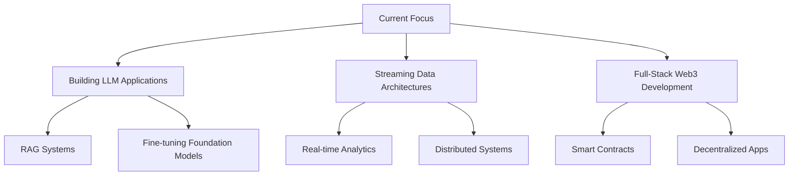

# 👨‍💻 RAVISHANKER GANDIGUDI | Digital Architect 🚀

  

## 🧠 The Digital Trifecta

> *"Code is poetry, data is wisdom, and AI is imagination."*

I operate at the intersection of three powerful domains:
- **Software Engineering** - Building robust, scalable applications
- **Data Engineering** - Architecting efficient data pipelines and warehouses
- **AI/ML Development** - Training models that learn and adapt

---

## 🛠️ Tech Arsenal

| **DOMAIN** | **TECHNOLOGIES** |
|------------|-----------------|
| **Frontend** |     |
| **Backend** |     |
| **Data Engineering** |     |
| **Machine Learning** |     |
| **Cloud & DevOps** |     |
| **Databases** |     |

---

## 🌟 Featured Projects

| **PROJECT** | **CATEGORY** | **TECH STACK** | **DESCRIPTION** |
|------------|--------------|----------------|-----------------|
| [**ShabdaAI**](https://huggingface.co/spaces/ravish5/ShabdaAI) | NLP / Multilingual AI | Python, Hugging Face Transformers, Gradio, Regex, NLLB-200 | Multilingual Q&A assistant (Telugu & Hindi ↔ English) with context-based and retrieval-based answering, deployed on Hugging Face Spaces |
| [**LLM Playground**](https://github.com/ravigandigudi/llm-playground) | AI/ML | Python, PyTorch, Transformers | Experimental platform for fine-tuning and deploying custom LLMs |
| [**DataFlow Pipeline**](https://github.com/ravigandigudi/Credit-Card-Fraud-detection-) | Data Engineering | Airflow, Spark, Kafka, S3 | End-to-end data pipeline for real-time analytics |

---

## 📊 GitHub Metrics

  

  
  

---

## 🎓 Education & Background

- **Master's in Computer Science** - Stevens Institute of Technology

---

## 🔮 What I'm Exploring Now

---

## 🤝 Let's Connect!

  

---

  

  
*Building the future, one line of code at a time*

